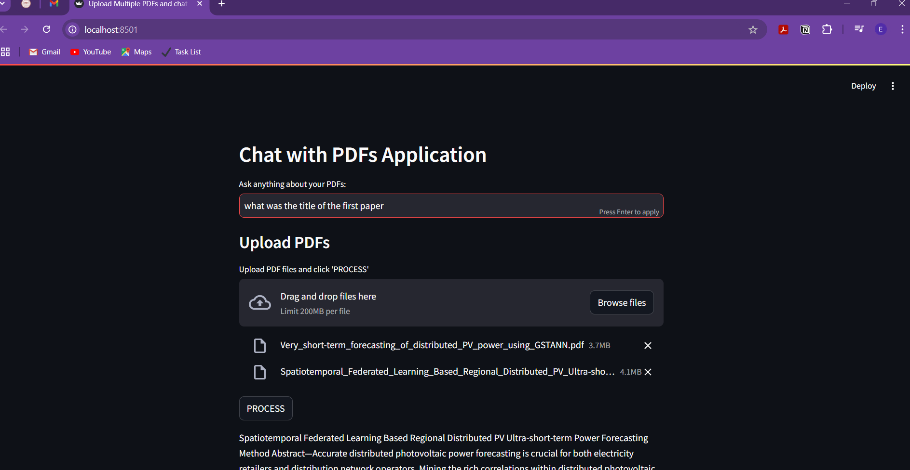

# 📚 Chat with PDF: Your Personal Document ChatBOT

Imagine having the ability to converse with your PDFs—whether it's understanding a dense research paper, summarizing a lengthy business document, or exploring hidden insights in a legal contract. That’s exactly what **Chat with PDF** offers: a seamless and intelligent way to unlock the potential trapped inside PDFs.

---

## 🎯 Problem Statement

Develop an interactive application using Streamlit or Chainlit that allows users to upload a PDF, converts its content into embeddings, and enables question-answering via an LLM.

---

## 🚀 How It Works: ARCHITECTURE

### 1️⃣ Upload Your PDF  
It all starts with a simple drag-and-drop, just upload your document.

### 2️⃣ Extract the Content  
After uploading click on the PROCESS button, the app uses PyPDF2 to read your PDF and present the content in a human-readable format. Say goodbye to endless scrolling through pages.

### 3️⃣ Generate Smart Embeddings  
The magic happens here! Using Google Gemini AI models, the app converts text into embeddings—compact representations of information—so it "understands" your document.

### 4️⃣ Ask Questions, Get Answers  
Curious about a specific topic? Just ask! The app searches its knowledge base and provides context-aware answers.

### 5️⃣ Dive Deeper  
Got multiple documents? Enable cross-PDF querying to connect the dots between related topics.

### FOR DETAILED FLOW CHART SEE MERMAID FILE.
---

## 💌 Demo

**Landing Page:**
- UI of the Landing Page.

**Upload:**
- Upload single or multiple PDFs(I HAVE UPLOADED SOME RESEARCH PAPERS ON AI/ML).

**Process:**
- Press Process to create chunks from your PDFs.

**Ask Any Related Question:**
- Ask the relevant questions or the topics you want to know about the Uploaded PDFs.

**Response:**
- Response is Generated. Used String ventures theme for the colors

**Continue Conversation:**
- Keep on asking the question Accordingly.

---

## ✨ What Makes It Special?

- **Ease of Use:** A beautifully simple interface powered by Streamlit.  
- **Intelligence at Scale:** Handles even large PDFs by splitting them into manageable chunks.  
- **Fast and Accurate:** Uses embeddings and similarity search to deliver precise answers.  
- **Extensible:** Ready for deployment on platforms like Streamlit Cloud or Hugging Face Spaces.  

---

## 💡 Behind the Scenes: The Tech Stack

This app leverages cutting-edge technologies to make interacting with PDFs seamless and intuitive:

- **Streamlit**: For an intuitive and interactive user interface.  
- **PyPDF2**: For seamless text extraction from PDFs.  
- **Google Gemini Embeddings**: To generate high-quality embeddings.  
- **FAISS**: For lightning-fast similarity search.  
- **Google Gemini 1.5 pro (LLM)**: Integrated with model Gemini for enhanced Q&A capabilities.  

---

## 🌱 Growing the Vision: What’s Next?

**Chat with PDF** is just the beginning. The journey ahead is full of exciting possibilities to make PDFs smarter and more interactive:

- **Highlight Answers**: Pinpoint exact locations in the PDF for each answer, making navigation effortless.
- **Cloud Integration**: Save, share, and access documents anytime, anywhere with cloud connectivity.  

---

**Chat with PDF** showcase my skills in AI, NLP, and solving real-world challenges, offering a smarter way to interact with static documents.

---

## 🤝 Let’s Connect

Have ideas or feedback? I’d love to hear from you!  

- **Email**: [vaibhavps3005@gmail.com](mailto:vaibhavps3005@gmail.com)  
- **LinkedIn**: [https://www.linkedin.com/in/vaibhav-pratap-singh-73550223a/](https://www.linkedin.com/in/vaibhav-pratap-singh-73550223a/)  
- **GitHub**: [https://github.com/vaibhavps05](https://github.com/vaibhavps05)  

